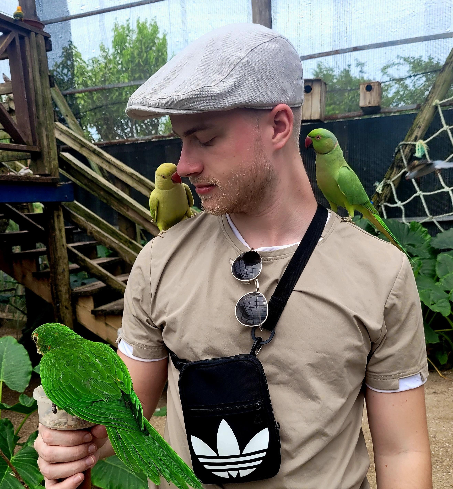

# Welcome To My Personal Page

<table>
  <tr>
    <td style="padding-right: 20px;">
      
    </td>
    <td>
      Hello! As an ambitious computer scientist with a focus on Computer Systems Security, I am constantly seeking out new challenges and opportunities to develop my skills and knowledge. I have a strong background in programming and development, as well as experience working on variable-sized projects individually or in a team.
    </td>
  </tr>
</table>

## Education
- **BSc. in Computer Science**
- **MSc. in Computer Science**

## Principal Domains of Interest
- **Networking and Cybersecurity**
- **Software Development**
- **Machine Learning**

## Languages
- **French:** Native
- **Dutch:** Native
- **English:** Fluent

## Hobbies
**🧠 Learning:** Always eager to acquire new knowledge and skills.

**🌐 Computer Science:** Passionate about the intricacies of ever-evolving digital technology.

**💻 Programming:** Passionate about coding and software development.

**🗺️ Traveling:** Enjoy exploring new places and cultures.

**🏀 Sports:** To keep me sane.
